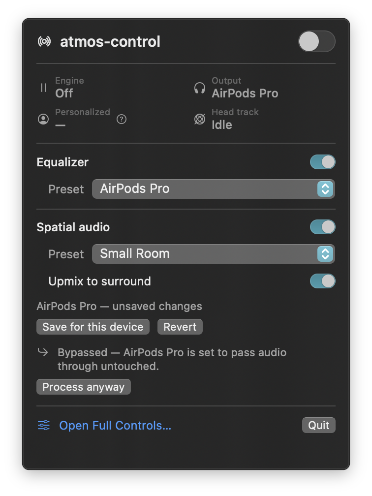
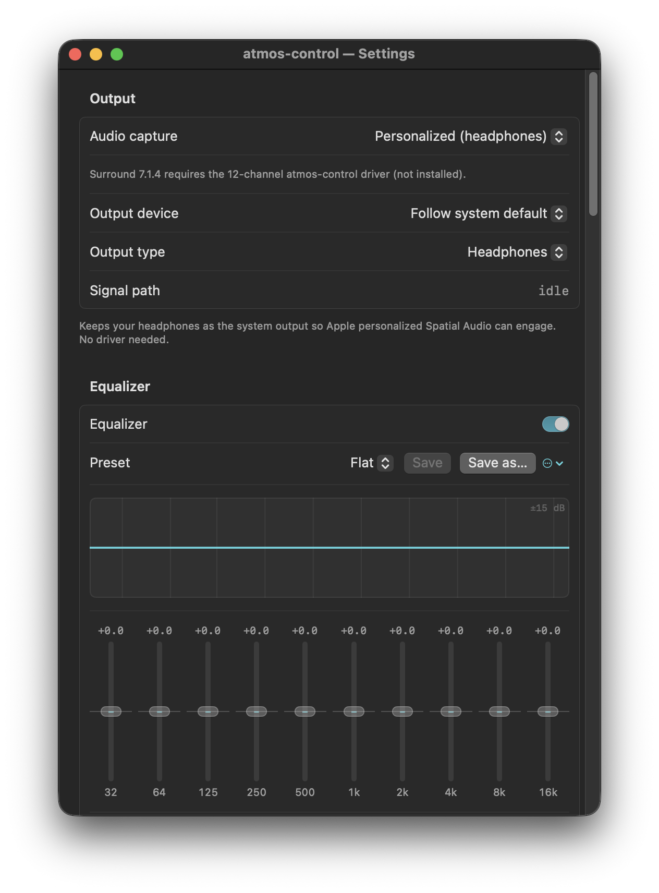

<p align="center">
  
</p>

# atmos-control (EQ + upmix fork)

**Personalized spatial audio for macOS** — system-wide, head-tracked binaural sound with a full
manual control surface over Apple's own spatial renderer (`AUSpatialMixer`). It runs as a menu-bar
app and spatializes everything your Mac plays to your headphones in real time, with personalized
HRTF and AirPods head tracking.

This is a **fork of [yukij3/atmos-control](https://github.com/yukij3/atmos-control)** that turns the
original spatializer into a complete everyday listening chain: a 10-band equalizer in front of the
renderer, an STFT stereo→surround upmixer behind it, presets and per-device profiles for both, and a
menu-bar panel reduced to the three switches you actually reach for. See
[Acknowledgements](#acknowledgements).

*(The upstream Russian translation, [README.ru.md](README.ru.md), describes the original project and is not updated for this fork.)*

atmos-control is **not** a Dolby Atmos decoder. It is a PCM equalizer, upmixer, and spatializer
driven by the same Apple DSP engine that powers Spatial Audio — it hands you manual control over
Apple's spatial renderer instead of a single system on/off switch.

---

## What this fork adds

| | Feature | Where |
|---|---|---|
| **F1** | 10-band equalizer (32 Hz … 16 kHz, ±12 dB, 1-octave parametric), applied before spatialization to stereo or independently to all twelve 7.1.4 feeds | Full Control ▸ Equalizer |
| **F2** | Automatic pre-amp — computes the combined response and pulls the output down so the loudest point of the curve sits at 0 dB (manual override available) | Full Control ▸ Equalizer ▸ Pre-amp |
| **F3** | EQ presets: save / rename / delete, JSON-persisted | Full Control ▸ Equalizer ▸ Preset |
| **F4** | **STFT stereo→surround upmixer** (direct/ambient separation, 5.1 or 7.1.4) feeding the spatial mixer's virtual speakers | Full Control ▸ Upmix |
| **F5** | Binaural rendering through `AUSpatialMixer` (inherited from upstream) | Full Control ▸ Soundstage / Rendering |
| **F6** | Spatial presets — the whole soundstage/rendering/reverb state under a name | Full Control ▸ Spatial presets |
| **F7** | Per-output-device profiles: EQ on/off + preset, spatial on/off + preset, or full **Bypass** for an AV receiver | Full Control ▸ Device profiles |
| **F8** | Rebuilt menu-bar panel: EQ switch + preset, Spatial switch + preset, Upmix switch. Everything else moved to Full Control | Menu-bar panel |
| | Launch at login (`SMAppService`), settings + presets persisted to JSON, IO stall watchdog, sample-rate-change recovery, sleep/wake handling | — |

Also in this fork: click-to-step sliders (click either side of the knob to nudge by exactly one
unit — see [Controls](#a-note-on-the-sliders)), and a single accent colour across every control.

## How it works

```
system audio ─▶ capture ─▶ 10-band EQ (2 ch) ─▶ STFT upmixer (2→6/12 ch) ─▶ AUSpatialMixer ─▶ headphones
                                 F1/F2                    F4                   F5 (binaural)
```

The EQ runs on the **stereo** signal before the upmixer — one filter pass instead of six or twelve,
and the upmixer's direct/ambient analysis then sees the signal you actually want to hear.

<p align="center">
  
</p>

1. **Capture** — the system mix is read via a process tap (default) or routed through the
   atmos-control virtual audio device (loopback modes).
2. **Equalize** — ten fixed bands plus an automatic pre-amp, applied to the stereo capture or independently to each channel of a true 7.1.4 capture.
3. **Upmix** (optional) — a short-time Fourier transform splits the stereo signal into *direct*
   sound (correlated, pannable) and *ambience* (uncorrelated), then distributes them across 6 or 12
   virtual speakers.
4. **Spatialize** — each channel/source is placed at its azimuth, elevation and distance and
   rendered through Apple's `AUSpatialMixer` (personalized HRTF when available, generic otherwise).
5. **Track** — with AirPods, head pose continuously updates so the soundstage stays fixed in the
   world while your head moves.
6. **Output** — the binaural result plays to your headphones. Nothing leaves the machine.

## Capture modes

| Mode | What it does | Driver needed | System Spatial Audio | Apple Music Dolby Atmos |
|---|---|---|---|---|
| **Personalized (headphones)** | Captures the system mix via a process tap and applies personalized, head-tracked binaural rendering. Default. | No | Off | Off |
| **Surround 7.1.4** | Routes true 12-channel multichannel through the virtual device and places each channel at its canonical speaker angle. | Yes — bundled driver (`./install.sh --with-driver`) **or** BlackHole 16ch (SIP-friendly, see `docs/BLACKHOLE_16CH.md`) | Off | Automatic |
| **Stereo (virtual device)** | Routes all audio through the virtual loopback device. Works with any output, but rendering is generic. | Yes — bundled driver **or** BlackHole 16ch | Off | Off |

- Personalized HRTF only engages in **Personalized** mode, with AirPods that have a scanned personal
  profile, and while system Spatial Audio is off.
- The upmixer needs a **stereo** capture, so it is available in Personalized and Stereo modes —
  not in Surround 7.1.4 (which is already multichannel).

## The menu-bar panel

<p align="center">
  
</p>


<p align="center">
  
</p>

---

# Settings reference

Every setting, what changing it does, and when you'd want to.

### A note on the sliders

All sliders in this fork are **click-to-step**: clicking the track to the right of the knob
increases the value by exactly one unit, clicking to the left decreases it. One "unit" is the
smallest change the readout can show (0.1 dB on the EQ, 0.01 on `Center strength`, 1° on
`Azimuth`, …). Dragging still works as usual; double-clicking a numeric readout resets that value.

## Output

| Setting | What it does | Change it when |
|---|---|---|
| **Audio capture** | Picks how audio gets into the engine (see [Capture modes](#capture-modes)). Rebuilds the whole graph. | You want true multichannel from Apple Music (Surround 7.1.4), or your output isn't headphones (Stereo virtual device). Otherwise leave on Personalized. |
| **Output device** | Where the rendered audio is played. "Follow system default" tracks whatever macOS is using. | You want atmos-control pinned to one device regardless of the system default. |
| **Output type** | Tells the renderer what it is rendering *for*: Headphones / Built-in Speakers / External Speakers. Headphones = binaural HRTF; the speaker types switch to crosstalk-aware virtualization. | Only if you route the result to speakers. Personalized HRTF requires **Headphones**. |
| **Signal path** | Read-only: the live chain (capture → EQ → upmix → mixer → device). | Diagnostics only. |

## Equalizer

| Setting | What it does | Change it when |
|---|---|---|
| **Equalizer** (switch) | Bypasses the whole EQ unit (not a per-band reset — your curve is kept). | A/B-ing the EQ against flat. |
| **Preset** | Loads a stored curve + pre-amp. `Flat` is built in and can't be edited; `•` marks unsaved edits. The `…` menu holds Save, Save as…, Rename, Delete. | Per-genre or per-headphone curves. |
| **Band faders** (32, 64, 125, 250, 500, 1k, 2k, 4k, 8k, 16k Hz) | ±12 dB on a 1-octave parametric band. Click above/below the knob for 0.1 dB; double-click to zero that band. | Tame a resonance, add low shelf-ish warmth, soften sibilance (4–8 kHz), etc. |
| **Pre-amp ▸ Auto** | Analyses the combined response and applies `−max(0, peak)` so the loudest point of your curve lands at 0 dB. Prevents EQ-induced clipping before the spatializer; positive Soundstage Gain or spatial summation can still raise the final output, so check Levels. | Leave it on. This is the safe default. |
| **Pre-amp ▸ Manual** | You set the headroom yourself (−24 … +12 dB, 0.1 dB steps). | You want extra level and know your curve won't clip, or you want to match loudness while A/B-ing. |
| **Flatten** | Zeroes all ten bands. | Starting over. |
| *curve peak* readout | How far the current curve overshoots 0 dB — the number Auto pre-amp is cancelling. | Diagnostics. |

## Upmix

Turning **Upmix stereo to surround** on or off (and changing **Target layout** or **FFT size**)
rebuilds the audio graph, so expect a brief gap. Everything else here is live.

One kernel does the extraction. The measurements behind it, the defects it fixes and the
reasoning borrowed from Auro-Matic / Apple / Sonos are written up in
[`docs/UPMIX-QUALITY.md`](docs/UPMIX-QUALITY.md); `tools/upmix-lab/` reproduces the numbers
offline (it still models the first-generation "Classic" kernel as `v1 (old kernel)`, because that
is the baseline for every before/after figure — the kernel itself has been removed from the app).

| Setting | What it does | Change it when |
|---|---|---|
| **Upmix stereo to surround** | Runs the STFT upmixer and switches the spatial mixer to 6 or 12 virtual speakers. | You want music/video to open up beyond the two front points. Off = the classic two-point stereo soundstage. |
| **Target layout** | `5.1` (L C R LFE Ls Rs) or `7.1.4` (adds rear surrounds and four height speakers). | 7.1.4 for films and anything with vertical ambience; 5.1 is what Apple's own "Spatialize Stereo" does and is lighter on CPU. |
| **Strength** | 0 … 1 — the master effect amount, Auro-Matic style. 0 passes the stereo signal through untouched; 1 is the full effect. | Your "how much upmix" knob. Use it to A/B against bypass, or dial the whole thing back on dense material. |
| **Center strength** | 0 … 1.5 — how much of the correlated centre (vocals, dialogue) is pulled out of L/R into the centre speaker. The pull is energy-exact, so moving it never changes the level. | Raise it if vocals feel vague between the ears; lower it if the mix sounds mono-ish and narrow. |
| **Surround level** | −24 … +6 dB on the surround speakers. | Raise for a bigger, more enveloping ambience; lower if the back of the room draws attention to itself. |
| **Height level** | −24 … +6 dB on the four height speakers (7.1.4 only). | Raise for more "ceiling" air; the default −6 dB keeps heights as a hint rather than an effect. |
| **Ambience spread** | 0 … 1 — how much of the extracted ambience leaves the front pair for the surrounds and heights (power-preserving crossfade). 0 keeps it all in front. | Raise for more envelopment on headphones; lower when the rear starts to pull attention away from the music. |
| **Decorrelation** | 0 … 1 — phase decorrelation applied to the ambient component (group delay bounded to ±2.5 ms, so transients stay intact). | Higher = wider, more diffuse ambience. Lower it if cymbals or applause start to smear. |
| **Ambient bias** | −12 … +12 dB — level trim on the ambience that is sent to the surrounds and heights. | Positive for a more reverberant, "in the room" feel; negative for focus and intelligibility. |
| **Surround spread** | 0.5 … 1.3× — scales the surround speaker angles. | Narrower (<1) for a tighter stage, wider (>1) for a larger room. |
| **LFE** | `Off` or `150 Hz low-pass`. Off by default: the low end is already in L/R, and the spatial mixer bypasses the LFE bus anyway. | Effectively diagnostic — leave Off. |
| **Transient preservation** | 0 … 1 — how fast the direct/ambience mask may open, plus an onset gate that briefly mutes the sends. The slider scales the gate's duck depth continuously (1 = the full −16.5 dB duck, 0 = no gate); measured across the range the attack leak falls −1.3 → −8.7 dB while a whole song only loses 0.2 dB of send level. | Keep at 1 for percussive material; lower it if you *want* attacks to bloom into the room. |
| **Reflections** | −24 … +6 dB — trim on the early-reflection layer that feeds the heights and rear surrounds (delayed, high-passed, HF-trimmed copies of the ground channels, weighted by physical adjacency, Auro-Matic style). | Raise for a more solid, "real room" height image; −24 dB to turn the synthesis off entirely. |
| **Bass management on the sends** | 150 Hz high-pass on everything sent to the surrounds and heights, so the low end stays in the front. | Leave it on. Off is diagnostic: it is what the old kernel did, and it is why the bass detached from the front. |
| **Auto level** | Slow (2 s) bed-domain trim so switching the upmixer on and off does not change the loudness. | Leave it on; turn it off to hear the raw upmix law in the lab measurements. |
| **FFT size** | 1024 (21 ms @48 kHz) or 2048 (43 ms). Larger = finer frequency resolution, better separation, more latency. | 2048 for music where separation matters; 1024 if you notice lip-sync drift on video. |
| **Added latency** | Read-only: the algorithmic delay the upmixer adds. | Audio lagging video is tolerated up to roughly 125 ms, so both sizes are safe — but this is the number to check. |

Measured on the bench (`tools/upmix-lab/`, raw tables in `tools/upmix-lab/results/`), 7.1.4,
auto-level off: the level response across the image is flat to 0.00 dB (the old kernel dipped 2.88 dB
mid-pan),
a hard-panned tone leaks −10.3 dB instead of landing 100 % in the surrounds, sub-120 Hz energy in the
sends drops from +0.9 dB to −17.8 dB, the front-stage timbre deviation on the synthetic song falls from
8.9 dB to 1.6 dB, and the per-bin send-gain wobble inside a critical band (what a sibilant "shh"
really is) drops from 2.8–4.1 dB to 0.2–0.7 dB. A click at 0 dB over a −26 dB bed leaks 8.7 dB less
into the surrounds (−5.0 → −8.7 dB), with no false triggers on stationary material.
`python3 tools/upmix-lab/upmix_lab.py --compare` prints the whole table.

A second, shorter analysis window for transient detection (the obvious next idea) was built, measured
and **rejected**: a half-length window sits further from the newest samples, so it hears an onset
*late*, and the shipped single-window gate beats it by 4.5 dB of attack leak. What shipped instead is
the continuous gate depth above. The whole experiment is still in the lab behind `multi_res=True` and
is written up in [`docs/UPMIX-QUALITY.md`](docs/UPMIX-QUALITY.md) §3.5.

## Soundstage

| Setting | What it does | Change it when |
|---|---|---|
| **Radar** | Drag the dot to set azimuth/distance directly. | Faster than the sliders. |
| **Source mode** | How the capture is presented to the renderer: `Stereo Points` (L/R as two virtual speakers), `Stereo Bed`, `Mono Point`, `Surround 7.1.4`, … When Upmix is on, the upmixer owns this and the picker is disabled. | Rarely. `Stereo Points` is the normal choice. |
| **Azimuth** | −180 … +180° — rotates the whole stage around you. | Offsetting the stage; 0° is dead ahead. |
| **Elevation** | −90 … +90° — raises/lowers the stage. | A few degrees up can lift a "too low" image. |
| **Distance** | 0.35 … 6 m — how far the virtual speakers sit from you. Interacts with the distance model and reverb below. | **The main "room size" control.** Closer = drier, more intimate, more in-head; farther = more distant and reverberant. |
| **Gain** | −40 … +12 dB — source gain into the renderer. | Compensating the level you lose by moving the source away (see the reference presets below). |
| **Stereo width** | 0 … 90° — the angle between the two virtual front speakers (`Stereo Points` only). | 30–40° is the classic stereo triangle; wider pulls the image apart, narrower collapses it towards mono. |
| **Reset soundstage** | Back to the defaults. | — |

## Personalization

| Setting | What it does | Change it when |
|---|---|---|
| **Head tracking** | Keeps the soundstage fixed in the world as you move your head (AirPods only). | Off if you listen while walking and the stage swimming bothers you. |
| **Personalized HRTF** | `Auto` / `On` / `Off` — whether Apple's scanned personal profile is used. Needs Personalized capture + Headphones output type + the Automatic/Output-type algorithm. | `Auto` is right for almost everyone. |
| **Status (3116)** | Read-only: what Apple's engine reports about personalization right now. | Verifying your personal profile actually engaged. |

> Control Center ▸ Sound ▸ AirPods ▸ **Spatial Audio must be OFF** while atmos-control runs,
> otherwise audio is spatialized twice.

## Rendering (Advanced)

| Setting | What it does | Change it when |
|---|---|---|
| **Algorithm** | `Automatic (by device)` picks per output device: AirPods get Apple's output-type path (so personalized HRTF can engage), everything else gets HRTF HQ. `HRTF` / `HRTF HQ` pin it; `Output type` is Apple's automatic path. | Pick **HRTF HQ** when you want the internal reverb and the full distance model — they are inert under Automatic/Output type. Pick **Automatic** when personalized HRTF matters more. |
| **Inter-aural delay** | Models the time difference between your ears, not just level. | Leave on; it's most of the externalization. |
| **Distance attenuation** | Turns the distance→loudness model on. | Off makes `Distance` purely tonal/spatial with no level change. |
| **Attenuation curve** | `Power` / `Exponential` / `Inverse` / `Linear` — how loudness falls with distance. `Inverse` is the physical 1/r law. | Mostly taste; `Inverse` is the realistic default. |
| **Reference distance** | 0.1 … 4 m — the distance at which there is no attenuation. | Raise it if moving the source away kills the level too quickly. |
| **Max distance** | 1 … 20 m — where attenuation stops increasing. | Rarely. |
| **Max attenuation** | 0 … 60 dB — the cap on distance attenuation. | Lower it if distant placements get too quiet. |
| **Room reverb** | The mixer's internal early-reflection/reverb engine. **Audible under HRTF / HRTF HQ only** — the controls grey out under Automatic/Output type (your settings are kept). | On for a sense of room; off for a dry, studio-style image. |
| **Room size** | `Small` / `Medium` / `Large`. | Small = tight and close; Large = concert-hall tails. |
| **Reverb blend** | 0 … 100 % wet. | **Use single digits.** Even 1–2 % is audible here; 10 % already sounds like an effect. |
| **Reset rendering** | Back to the defaults. | — |

(`globalReverbGain`, −3 dB, is written to the preset file but has no UI control.)

## Spatial presets

A spatial preset stores **everything above except the equalizer and the capture mode** — soundstage,
personalization, rendering, reverb *and* the upmix settings (including whether upmix is on). Save,
Save as…, Rename, Delete from the `…` menu; `•` marks unsaved edits. Selecting a preset applies it
immediately, including switching the upmixer in or out.

## Device profiles

When the output device changes, atmos-control applies that device's profile.

| Setting | What it does |
|---|---|
| **Mode ▸ Process** | Run the engine on this device with the EQ/spatial choices below. |
| **Mode ▸ Bypass** | Don't touch this device at all — no tap, no rendering. Use for an AV receiver or TV that should get the original multichannel stream untouched. |
| **Equalizer / EQ preset** | What the EQ does when this device appears. |
| **Spatial audio / Spatial preset** | What the renderer does when this device appears. |
| **Apply automatically** | Off = remember the device but never change anything when it connects. |
| **Any other device** | The fallback profile for devices with no entry of their own. |

Manual changes you make while a device is active are **session-scoped**: the panel shows
`<device> — unsaved changes` with **Save for this device** / **Revert**. Nothing is written to the
profile until you press Save.

## General

| Setting | What it does |
|---|---|
| **Launch at login** | Registers the app as a login item via `SMAppService`. |
| **Settings file** | `~/Library/Application Support/atmos-control/settings.json` — settings, presets and profiles, written about a second after you stop making changes. |

## Levels

Read-only meters for gain staging and diagnostics. **Output peak L/R** is measured at the final
app output after EQ and, when enabled, the spatial render (so it follows both EQ Pre-amp and
Soundstage Gain, and can report above 0 dBFS). The per-channel speaker-feed meter appears for
true surround capture and 5.1/7.1.4 upmix; those bars are measured after EQ and Soundstage Gain,
before spatial rendering. A red `OVER` warning marks feeds at or above 0 dBFS. Reduce Pre-amp
or Soundstage Gain when `OVER` appears, then aim just below 0 dBFS. Debug builds can also show
ring fill and captured/played frame counters.

---

# Reference values

Two working presets, as they appear in the UI. Use them as a
starting point, then move `Distance`, `Gain` and `Reverb blend` together.

### Common to both

| Section | Setting | Value |
|---|---|---|
| Output | Output type | Headphones |
| Equalizer | Equalizer / Preset / Pre-amp | On / Flat / Auto |
| Soundstage | Source mode | Stereo Points (upmix takes over while it is on) |
| Soundstage | Azimuth / Elevation | 0° / 0° |
| Soundstage | Stereo width | 35° |
| Personalization | Head tracking | On |
| Personalization | Personalized HRTF | Auto |
| Rendering | Algorithm | **HRTF HQ** |
| Rendering | Inter-aural delay | On |
| Rendering | Distance attenuation | On |
| Rendering | Attenuation curve | Inverse |
| Rendering | Reference distance | 1.00 m |
| Rendering | Max distance | 6.0 m |
| Rendering | Max attenuation | 30 dB |
| Rendering | Room reverb | On |
| Rendering | Reverb blend | 1 % |
| Upmix | Upmix stereo to surround | On |
| Upmix | FFT size | 2048 |
| Upmix | Surround level | +0 dB |
| Upmix | Height level | −6 dB |
| Upmix | LFE | Off |

### "Small Room" — near-field, 5.1

| Section | Setting | Value |
|---|---|---|
| Soundstage | **Distance** | **1.40 m** |
| Soundstage | **Gain** | **+5 dB** |
| Rendering | **Room size** | **Small** |
| Upmix | **Target layout** | **5.1** |
| Upmix | Center strength | 1.35 |
| Upmix | Decorrelation | 0.65 |
| Upmix | Ambient bias | −3 dB |
| Upmix | Surround spread | 1.00× |

Close, focused, slightly dry — good for vocals, podcasts and anything where intelligibility matters.

### "Middle Room" — mid-field, 7.1.4

| Section | Setting | Value |
|---|---|---|
| Soundstage | **Distance** | **1.80 m** |
| Soundstage | **Gain** | **+9 dB** |
| Rendering | **Room size** | **Medium** |
| Upmix | **Target layout** | **7.1.4** |
| Upmix | Center strength | 1.35 |
| Upmix | Decorrelation | 0.80 |
| Upmix | Ambient bias | −3 dB |
| Upmix | Surround spread | 1.00× |

A step back into a larger room with height channels — films, live recordings, anything atmospheric.
Note how `Gain` rises with `Distance`: with the inverse curve, +0.4 m costs roughly 4 dB.

---

## Requirements

- Apple Silicon Mac (arm64).
- macOS 15 or newer (macOS 26 recommended).
- Xcode command line tools (`xcode-select --install`) — provides `swift`.
- AirPods Pro (with a scanned Personalized Spatial Audio profile) for the personalized,
  head-tracked experience. Any headphones work with the generic HRTF.

## Install

```bash
git clone <your-fork-url> atmos-control
cd atmos-control
./install.sh
```

`install.sh` is idempotent — re-running it rebuilds and replaces the installed app. It builds the
package, assembles `dist/atmos-control.app`, and copies it into `/Applications`. It never changes
your default output device.

The optional HAL driver is only needed for the two loopback capture modes.
BlackHole 16ch can be used instead (SIP-friendly, no driver install required).
See `docs/BLACKHOLE_16CH.md` for setup and the required Audio MIDI Setup
speaker assignment (channels 1–12).

```bash
./install.sh --with-driver
```

The driver install is privileged: it copies the driver into `/Library/Audio/Plug-Ins/HAL` and
restarts Core Audio, which makes audio devices blink out for about a second.

### Manual install (step by step)

| Step | Command |
|---|---|
| Build the package | `swift build -c release` |
| Build the app bundle | `bash App/build-app.sh release` |
| Install the app | `cp -R dist/atmos-control.app /Applications/` |
| (optional) Build the driver | `bash Driver/build.sh` |
| (optional) Install the driver | `sudo cp -R Driver/.build/atmos-control.driver /Library/Audio/Plug-Ins/HAL/` |
| (optional) Own it root:wheel | `sudo chown -R root:wheel /Library/Audio/Plug-Ins/HAL/atmos-control.driver` |
| (optional) Reload Core Audio | `sudo launchctl kickstart -k system/com.apple.audio.coreaudiod` |

## First run

```bash
open /Applications/atmos-control.app
```

atmos-control is a menu-bar app (`LSUIElement`) — no Dock icon. On the first engine start, macOS
asks for the system-audio-recording permission. Grant it; capture is local and nothing is uploaded.
If the engine runs but everything is silent, the panel says so and offers a shortcut to
System Settings ▸ Privacy & Security ▸ Screen & System Audio Recording.

## Before you listen

- **Turn off system Spatial Audio** (Control Center ▸ Sound ▸ AirPods ▸ Spatial Audio), otherwise
  audio is spatialized twice.
- **Apple Music ▸ Dolby Atmos**: Off for Personalized/Stereo capture; Automatic for Surround 7.1.4.

## Update / uninstall

```bash
git pull && ./install.sh        # add --with-driver if you use the loopback modes
./uninstall.sh                  # removes the app
./uninstall.sh --with-driver    # also removes the driver (privileged; Core Audio restarts)
```

This fork stores settings, presets and device profiles in
`~/Library/Application Support/atmos-control/` — delete that folder to reset everything. If you
enabled **Launch at login**, turn it off before uninstalling (or remove the entry in
System Settings ▸ General ▸ Login Items).

## Troubleshooting

- **No sound at all, or sound only when you change a setting.** Usually the system-audio-recording
  permission: the tap returns silence while reporting success. The panel detects this (no non-zero
  sample after several seconds) and offers the Privacy settings shortcut. Grant it, then toggle the
  power switch.
- **"Audio stalled — the engine restarted itself."** The IO watchdog noticed frames stopped moving
  (device reset, aggregate lost a sub-device, tap died) and rebuilt the graph. One-off messages are
  normal after a device hiccup; repeated ones mean the device or driver is unstable.
- **Default device stuck on the virtual sink** after using a loopback mode: set it back in
  Control Center ▸ Sound.
- **Loopback modes greyed out**: no loopback device was found — install the driver
  (`./install.sh --with-driver`) or BlackHole 16ch (see `docs/BLACKHOLE_16CH.md`).
- **Personalized reads "Generic"**: it needs Personalized capture + Headphones output type +
  the Automatic/Output-type algorithm + AirPods with a scanned profile. Rendering is still binaural,
  just with the generic HRTF.
- **Reverb controls greyed out**: you're on the Automatic or Output-type algorithm, where the
  internal reverb is inert. Switch to HRTF or HRTF HQ.

## Development

```bash
swift build -c release          # build everything
bash App/build-app.sh release   # app bundle into dist/
ATMOS_PREVIEW=1 open -n dist/atmos-control.app   # panel in a normal window
```

Layout:

| Path | What's in it |
|---|---|
| `Sources/SpatialEngine/` | The engine library: `SpatialEngine` (graph + lifecycle), `Audio` (realtime callbacks, SPSC ring, `AUSpatialMixer`), `EqualizerUnit` (`AUNBandEQ` for stereo), `SurroundEqualizer` (12-channel DSP bank), `STFTUpmixer` + `Decorrelator`, `ProcessTap`, `Devices`, `ConfigCodable` |
| `Sources/AtmosControlApp/` | The SwiftUI app: `EngineController` (the view model and all orchestration), `PanelView`, `SettingsView`, `EQView`, `UpmixView`, `ProfilesView`, `SettingsStore`, `StepSlider` |
| `Driver/` | The optional HAL virtual device |
| `App/build-app.sh` | Bundle assembly + ad-hoc signing |
| `docs/PLAN.md` | Upstream architecture plan |

Other targets kept from upstream: `Phase0Spike` (validates that personalized HRTF + head tracking
engage in an app-hosted `AUSpatialMixer`), `AtmosDaemon` (CLI over the engine with a 1 Hz
diagnostic), `TapSpike` (process-tap capture spike). Environment variables for the spikes:

| Variable | Values (default in bold) | AU property |
|---|---|---|
| `SECONDS` | integer > 0 (**25**) | run duration |
| `SWEEP` | **0** / 1 | sweep azimuth −90 → +90 degrees |
| `OUTPUT_TYPE` | **headphones** / builtin / external | `SpatialMixerOutputType` (3100) → 1 / 2 / 3 |
| `HRTF_MODE` | **auto** / on / off | `SpatialMixerPersonalizedHRTFMode` (3113) → 2 / 1 / 0 |
| `ALGO` | **useoutputtype** / hrtf / hrtfhq | `SpatializationAlgorithm` → 7 / 2 / 6 |

## Acknowledgements

This project is a fork of **[atmos-control](https://github.com/yukij3/atmos-control)** by
**dmitrijtretakov** ([@yukij3](https://github.com/yukij3)). The hard parts — getting Apple's
`AUSpatialMixer` to host personalized HRTF and AirPods head tracking from an unentitled app,
the muting process-tap capture path, the realtime graph and SPSC ring, the HAL driver with its
7.1.4 channel layout, and the UI language this fork follows — are all upstream work. Everything
here is built on top of it. Thank you.

## License

MIT, same as upstream. Copyright (c) 2026 dmitrijtretakov — see [LICENSE](LICENSE).
